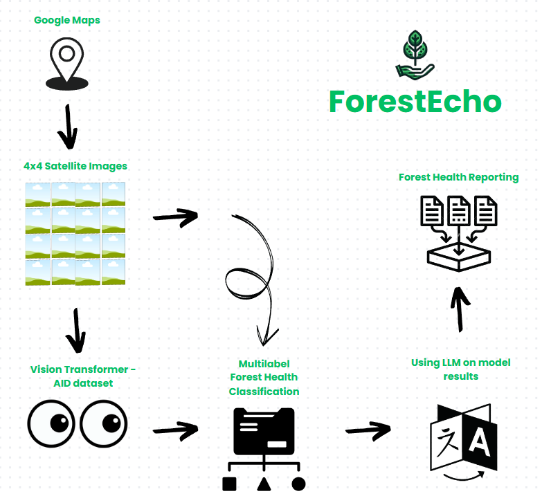

### ForestEcho: Empowering decisions with the echoes of our forests, one sustainable action at a time. 🌲

Imagine a world where we could protect forests more effectively, potentially saving **100 million trees every year**. This vision is closer to reality with **ForestEcho**—a platform that uses satellite data and AI to monitor forest health, empowering decision-makers to take timely, informed actions.

Forests are disappearing at an alarming rate. In **2022**, we lost **9.9 billion trees**, the forest impacts **80% of land-based species** and contributes to **30% of global carbon impact**. Amidst this crisis, ForestEcho provides crucial insights, aiming to reduce deforestation by **5-10%** each year.

---

### How ForestEcho Works

ForestEcho combines advanced technology with intuitive features to deliver real-time forest insights:

1. **Interactive Map**: Users explore locations on an interactive map and request health reports for specific regions.

2. **AI-Powered Analysis**: 
   - **Vision Transformer Model**: Processes satellite images to identify and categorize forested areas.
   - **Forest Health Classification**: Goes beyond simple labels, highlighting “primary” (healthy) areas and flagging concerns like haze, water encroachment, and infrastructure impacts.

3. **Forest Health Reporting**: ForestEcho generates detailed reports within seconds, summarizing forest health, environmental stressors, and recommendations based on recent satellite data.

<!-- Adding image under the third point -->

  

---

### Built for Impact

ForestEcho’s architecture integrates:
- **Interactive Maps** for user exploration.
- **Satellite Image Retrieval** for up-to-date visuals.
- **Vision Transformer Model** to classify forest types.
- **Forest Health Classification** to assess healthy and stressed zones.
- **Language Models** for clear, actionable reports.

---

### Why ForestEcho Matters

ForestEcho is designed for real-world impact, enabling:
- **Forest Health Monitoring** to address threats as they arise.
- **Drone Forestation** to target replanting projects.
- **Biodiversity Conservation** to protect habitats.
- **Wildfire Risk Management** to identify high-risk areas.
- **Carbon Credit Validation** with reliable forest health data.

---

### Video link/Live Demo/Pitching Link

- **[Youtube Video Link](https://youtu.be/sq_5cilhGQM)**

- **[Live Website](http://34.55.73.80:3000/)**

- **[Canva Pitch Presentation](https://www.canva.com/design/DAGWAeHip2I/pbYZtxCAtDe9RpAXMAoA7g/edit)**

---

### The Road Ahead

As we refine ForestEcho, expanding data sources, enhancing prediction, and collaborating with conservation groups will amplify its impact. ForestEcho translates satellite data into actionable insights, supporting sustainable decisions for forest health.

---

ForestEcho transforms satellite data into a powerful ally for forests, giving us the tools to preserve our planet’s lungs, one sustainable action at a time.
